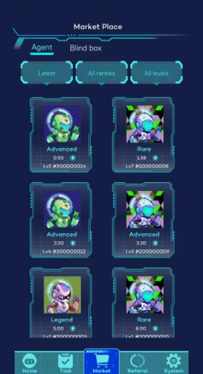

# Alaya web app

Alaya supports email registration and login to maximise accessibility for first-time and non-Web3 natives. All users are provided with a base-level Alaya NFT upon registration, users must hold at least one Alaya NFT of any level with sufficient remaining energy points to complete training tasks and earn rewards.

## Login to the website.

[https://www.aialaya.io/web/alaya/game.html](https://www.aialaya.io/web/alaya/game.html)

## NFT System

Alaya utilises a dual-NFT design consisting of Alaya NFTs and Medallion NFTs. The dual-NFT design is implemented to distinguish gamified user incentives and personal achievements from system labelling and optimisation features.

#### Home and Task view

    

-  Alaya NFTs are distributed to users for free upon registration, Alaya NFTs are required for users to complete training tasks, obtain task rewards, and participate in community events. They can be understood as the “player character” of Alaya’s gamified UI and can be freely traded.

- Medallion NFTs are non-tradeable NFTs that enable system labelling, user ranking, and targeted task distribution. Medallion NFTs can only be obtained through personal achievements and are wallet-bound. They are essential for Alaya’s optimisation algorithm to distribute tasks and aggregate/pre-process datasets accurately and efficiently.

- Both Alaya NFTs and Medallion NFTs can be upgraded by consuming in-game experience points and $AGT at set intervals. Users receive bonus attribute points per NFT upgrade to further enhance rewards and unlock advanced/specialised tasks.

## Task Categories

1. General Tasks
-  General tasks are available immediately for every user upon registration on Alaya AI and can be completed as long as users hold at least one Alaya NFT of any level with sufficient remaining energy points.
2. Specialised Tasks
-  Users must first acquire medallion NFTs in each specific area of expertise before they can access corresponding specialised tasks. Medallion NFTs are wallet-bound NFTs rewarded to users as personal achievements in different areas of expertise. They are crucial for Alaya’s optimisation algorithms and serve as a non-intrusive mechanism to verify user expertise without requiring KYC or formal qualifications.

3. Advanced Tasks
-  Both general and specialised tasks may be given in advanced formats and may require users to possess high-level NFTs or a minimum amount of staked $AGT to access.

## Alaya Marketplace

Clicking on the Market button brings you to the marketplace where you can purchase or sell NFTs and blind boxes.

#### Market view

## Referral link
Users can gain additional rewards and commissions for user onboarding by sharing their referral links.

#### Referral view

## User settings

User settings can be accessed via the System interface. All information is voluntarily provided, Alaya does not require users to declare any personal information to participate in the platform.

#### System view

